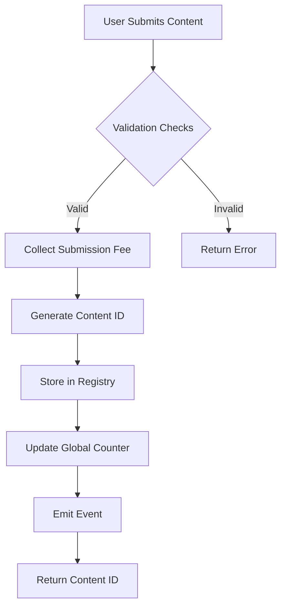
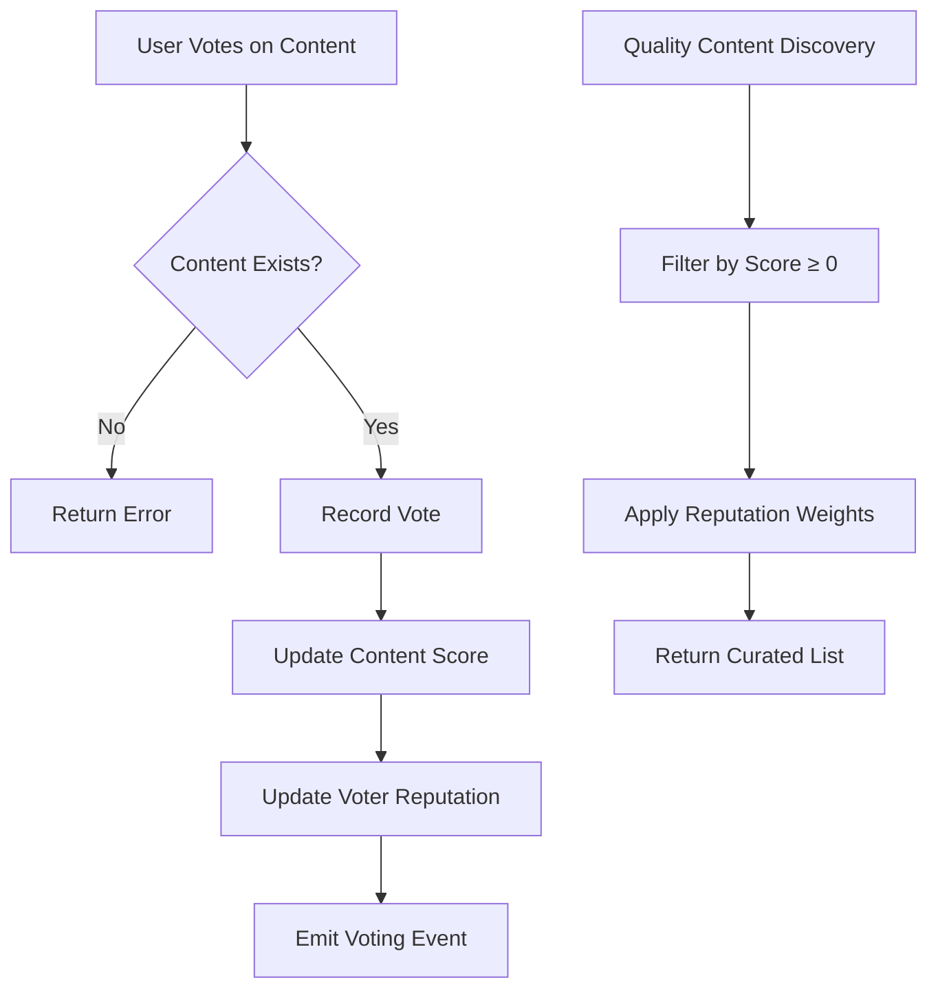
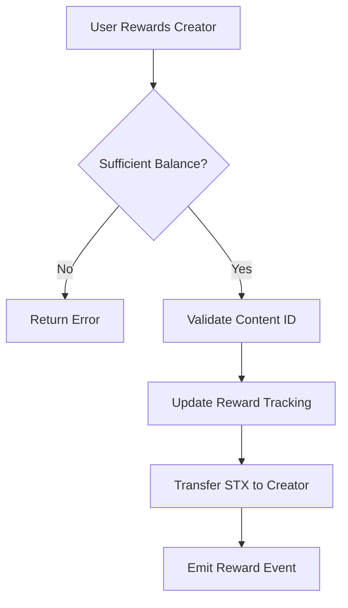

# BitCurate - Decentralized Content Curation Protocol

[](https://stacks.co)
[](https://bitcoin.org)
[](https://clarity-lang.org)

A Bitcoin-secured decentralized protocol that democratizes content discovery through community-driven curation, transparent reputation systems, and economic incentive alignment on the Stacks blockchain.

## Overview

BitCurate transforms traditional content platforms by implementing a trustless ecosystem where content value is determined through collective community intelligence rather than opaque algorithms. The protocol enables communities to self-organize around quality content while maintaining complete transparency and censorship resistance.

### Key Features

- **Economic Spam Prevention**: Stake-based content submissions with configurable fees
- **Reputation-Weighted Curation**: Community-driven quality assessment system
- **Zero-Fee Creator Monetization**: Direct peer-to-peer reward distribution
- **Democratic Content Moderation**: Community consensus-based flagging system
- **Multi-Category Organization**: Dynamic content categorization with expansion capabilities
- **Immutable Audit Trail**: Complete transparency of all community interactions
- **Bitcoin-Level Security**: Inherits Bitcoin's security model through Stacks integration

## System Architecture

### Core Components

```
┌─────────────────────────────────────────────────────────────┐
│                    BitCurate Protocol                       │
├─────────────────────────────────────────────────────────────┤
│  Content Registry  │  Voting System  │  Reputation Engine  │
│                    │                 │                     │
│  • Content Storage │  • Vote Tracking│  • User Scores      │
│  • Metadata Mgmt   │  • Score Calc   │  • Weight System    │
│  • Category System │  • Vote History │  • Merit Tracking   │
└─────────────────────────────────────────────────────────────┘
           │                    │                    │
           ▼                    ▼                    ▼
┌─────────────────────────────────────────────────────────────┐
│                     Stacks Blockchain                      │
├─────────────────────────────────────────────────────────────┤
│  State Management  │  Transaction Processing │ Event Logs  │
│                    │                         │             │
│  • Data Variables  │  • STX Transfers        │ • Indexing  │
│  • Storage Maps    │  • Access Control       │ • Analytics │
│  • Configuration   │  • Fee Processing       │ • Auditing  │
└─────────────────────────────────────────────────────────────┘
           │                    │                    │
           ▼                    ▼                    ▼
┌─────────────────────────────────────────────────────────────┐
│                     Bitcoin Network                        │
├─────────────────────────────────────────────────────────────┤
│           Final Settlement & Security Layer                 │
│                                                             │
│  • Consensus Finality    • Immutable History               │
│  • Cryptographic Proofs • Decentralized Security           │
└─────────────────────────────────────────────────────────────┘
```

## Contract Architecture

### Data Structures

#### Content Registry

```clarity
content-registry: {
  content-id: uint,
  creator: principal,
  title: string-ascii,
  url: string-ascii,
  category: string-ascii,
  creation-block: uint,
  community-score: int,
  total-rewards: uint,
  flag-count: uint
}
```

#### Voting System

```clarity
user-votes: {
  voter: principal,
  content-id: uint,
  vote-value: int  // -1 (downvote) or 1 (upvote)
}
```

#### Reputation Engine

```clarity
user-reputation: {
  user: principal,
  reputation-score: int  // Accumulated from voting activity
}
```

### State Variables

- **content-submission-fee**: Economic barrier to prevent spam
- **total-content-count**: Global content counter for ID generation
- **available-categories**: Dynamic list of content categories

## Data Flow

### Content Submission Flow



### Voting & Reputation Flow



### Reward Distribution Flow



## Core Functions

### Content Management

- **`submit-content`**: Submit new content with stake requirement
- **`vote-on-content`**: Community voting with reputation integration
- **`reward-creator`**: Direct creator monetization
- **`flag-content`**: Community-driven content moderation

### Query Functions

- **`get-content-info`**: Retrieve complete content metadata
- **`get-trending-content`**: Quality-filtered content discovery
- **`get-user-reputation`**: User reputation lookup
- **`get-total-content-count`**: Platform statistics

### Governance Functions

- **`update-submission-fee`**: Economic parameter adjustment
- **`remove-content`**: Content removal for policy violations
- **`add-content-category`**: Dynamic category expansion

## Economic Model

### Anti-Spam Mechanism

- Configurable submission fees create economic barriers
- Fee collection helps fund protocol development
- Prevents low-quality content flooding

### Creator Monetization

- Direct peer-to-peer STX transfers
- Zero platform fees
- Transparent reward tracking
- Community-driven value assessment

### Reputation System

- Voting activity builds user reputation
- Quality content creators gain community recognition
- Reputation influences content discovery algorithms

## Security Features

### Access Control

- Owner-only administrative functions
- Content creator protection from self-flagging
- Arithmetic overflow protection

### Data Integrity

- Immutable content history
- Transparent voting records
- Cryptographic proof of all transactions

### Economic Security

- Stake-based submission system
- Balance verification for all transfers
- Spam prevention through economic incentives

## Getting Started

### Prerequisites

- Stacks wallet with STX tokens
- Understanding of Clarity smart contracts
- Access to Stacks testnet/mainnet

### Deployment

```bash
# Deploy to Stacks testnet
clarinet deploy --testnet

# Deploy to Stacks mainnet
clarinet deploy --mainnet
```

### Basic Usage

```clarity
;; Submit content (requires submission fee)
(contract-call? .bitcurate submit-content 
  "Decentralized Web Article" 
  "https://example.com/article" 
  "Technology")

;; Vote on content (1 for upvote, -1 for downvote)
(contract-call? .bitcurate vote-on-content u1 1)

;; Reward creator (transfer STX directly)
(contract-call? .bitcurate reward-creator u1 u100)

;; Get trending content
(contract-call? .bitcurate get-trending-content u10)
```

## Governance

The protocol includes administrative functions for:

- Economic parameter tuning
- Content category management
- Policy violation handling

All governance actions are transparent and recorded on-chain, ensuring community accountability.

## Roadmap

- [ ] Multi-signature governance implementation
- [ ] Advanced reputation algorithms
- [ ] Cross-chain content syndication
- [ ] Mobile application development
- [ ] Creator analytics dashboard

## Contributing

BitCurate is an open protocol welcoming community contributions. Please review our contribution guidelines and submit pull requests for improvements.

## License

This project is licensed under the MIT License - promoting open-source adoption and community development.
